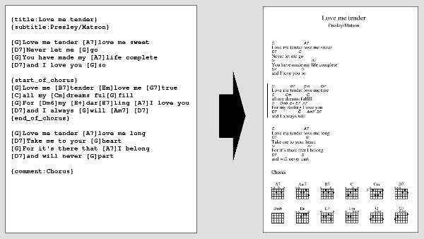

Chordpro brukes når man vil ha nøyaktig plassering av akkorder i tekst-dokumentet, og ha mulighet til å transponere når som helst.



Chordro er bare vanlige *.txt*-filer, men man kan generere (blant annet) pdf ut av det.

## App-er?
Det er mange programmer som støtter å vise chordpro-notering. 
### OnSong
https://onsongapp.com/

## Installasjon

Se [https://www.chordpro.org](https://www.chordpro.org/chordpro/ChordPro-Installation.html) for hjelp til installasjon.

Dersom du har Mac kan du installere *Chordpro Cli*-programmet ved å skrive ``sudo /usr/bin/cpan chordpro`` i terminalen din.

## Generere sanger i alle tonearter

Dette er "scriptet" jeg kjører i terminalen for å generere sanger i alle tonearter:

```bash
#!/bin/bash

#Change directory to where this file is at.
cd "`dirname "$0"`" 

mkdir PDF

# Gå inn i txt mappen med alle chordpro.txt-filene
# echo -e "\n\033[0;32m Navigating into TXT folder\033[0m"
cd TXT 

rm -rf temp
# echo -e "\n\033[0;32m Creating temp folder\033[0m"
mkdir temp

for f in *.txt; do
    echo -e "\n\033[0;32m Copy $f => temp/  \033[0m"
    cp "$f" temp/
done

# echo -e "\n\033[0;32m Navigating into temp folder\033[0m"
cd temp
ls
#For hver fil som er av type .txt, 
#generer pdf-er vha. chordpro-programmet
echo -e "\n\033[0;32m Generating PDFS. This might take a while... \033[0m"
for f in *.txt; do
    { chordpro "$f" -x 0 -o "${f%.txt}+00.pdf" ; mv "${f%.txt}+00.pdf" ../../PDF/ ; } & 
    { chordpro "$f" -x 1 -o "${f%.txt}+01.pdf" ; mv "${f%.txt}+01.pdf" ../../PDF/ ; } & 
    { chordpro "$f" -x 2 -o "${f%.txt}+02.pdf" ; mv "${f%.txt}+02.pdf" ../../PDF/ ; } & 
    { chordpro "$f" -x 3 -o "${f%.txt}+03.pdf" ; mv "${f%.txt}+03.pdf" ../../PDF/ ; } & 
    { chordpro "$f" -x 4 -o "${f%.txt}+04.pdf" ; mv "${f%.txt}+04.pdf" ../../PDF/ ; } & 
    { chordpro "$f" -x 5 -o "${f%.txt}+05.pdf" ; mv "${f%.txt}+05.pdf" ../../PDF/ ; } & 
    { chordpro "$f" -x 6 -o "${f%.txt}+06.pdf" ; mv "${f%.txt}+06.pdf" ../../PDF/ ; } & 
    { chordpro "$f" -x 7 -o "${f%.txt}+07.pdf" ; mv "${f%.txt}+07.pdf" ../../PDF/ ; } & 
    { chordpro "$f" -x 8 -o "${f%.txt}+08.pdf" ; mv "${f%.txt}+08.pdf" ../../PDF/ ; } & 
    { chordpro "$f" -x 9 -o "${f%.txt}+09.pdf" ; mv "${f%.txt}+09.pdf" ../../PDF/ ; } & 
    { chordpro "$f" -x 10 -o "${f%.txt}+10.pdf"; mv "${f%.txt}+10.pdf" ../../PDF/ ; } & 
    { chordpro "$f" -x 11 -o "${f%.txt}+11.pdf"; mv "${f%.txt}+11.pdf" ../../PDF/ ; } & 
    { chordpro "$f" -l -o "${f%.txt}+lyrics.pdf" ; mv "${f%.txt}+lyrics.pdf" ../../PDF/; } &
done

echo -e "\n\033[0;32m You may now close this window. \t The process will finish in the background. \n Check the PDF-folder. It should fill up with pdfs when they are done. \033[0m"
```
